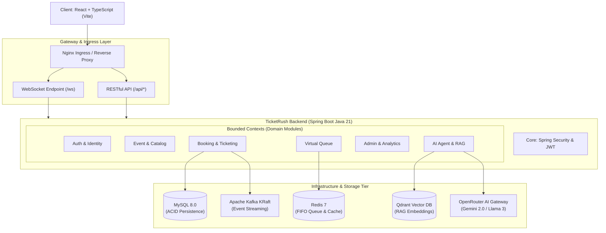

# Kiến Trúc Hệ Thống TicketRush (System Architecture Blueprint)

Tài liệu này mô tả toàn diện kiến trúc tổng thể, mô hình thiết kế và các nguyên lý kỹ thuật được áp dụng trong nền tảng bán vé chịu tải cao **TicketRush**.

---

## 1. Tổng Quan Kiến Trúc (Architectural Overview)

TicketRush được xây dựng theo mô hình **Modular Monolith kết hợp Event-Driven Architecture**, tối ưu hóa cho các đợt mở bán vé có lượng truy cập đột biến cực lớn (**Flash Sale / Ticket Rush**).



---

## 2. Các Phân Hệ Nghiệp Vụ (Bounded Contexts)

Hệ thống được module hóa thành 6 phân hệ cốt lõi với ranh giới trách nhiệm rõ ràng:

### 2.1 Phân Hệ Xác Thực & Danh Tính (Auth & Identity)
- **Mục đích:** Quản lý tài khoản, phân quyền RBAC (`USER`, `ADMIN`), xác thực phi trạng thái (Stateless) qua JWT Token.
- **Tính năng chính:**
  - Đăng ký, đăng nhập với mã hóa mật khẩu BCrypt.
  - Quên mật khẩu & xác thực qua mã OTP.
  - Cập nhật hồ sơ cá nhân và kiểm tra trùng lặp email/username tức thì.

### 2.2 Phân Hệ Sự Kiện & Sơ Đồ Khán Đài (Event & Catalog)
- **Mục đích:** Quản lý danh mục sự kiện giải trí, âm nhạc, thể thao và mô hình hóa không gian chỗ ngồi.
- **Tính năng chính:**
  - Phân cấp không gian: `Event` -> `Zone` (Khán đài) -> `Seat` (Ghế ngồi).
  - Tìm kiếm toàn văn theo từ khóa, thể loại, thành phố và khoảng thời gian.
  - Tải ảnh đại diện sự kiện lên Cloudinary.

### 2.3 Phân Hệ Đặt Vé & Thanh Toán (Booking & Ticketing)
- **Mục đích:** Xử lý giữ chỗ đồng thời (Concurrency Handling), chống mua trùng lặp (Race Condition), thanh toán và xuất vé.
- **Cơ chế kỹ thuật cốt lõi:**
  - **Pessimistic Locking (`PESSIMISTIC_WRITE`):** Khóa dòng ghế ở tầng Database để đảm bảo duy nhất 1 người được giữ chỗ.
  - **Cơ chế Giữ chỗ 10 phút:** Tự động giải phóng ghế qua `SeatReleaseScheduler` nếu khách hàng không hoàn tất thanh toán trong 10 phút.
  - **Mã QR Động:** Tích hợp thư viện ZXing sinh mã QR định danh vé điện tử ngay khi thanh toán thành công.
  - **Kafka Streaming:** Đẩy `BookingEvent` và `PaymentEvent` vào Kafka để xử lý tuần tự và kích hoạt luồng gửi email bất đồng bộ.

### 2.4 Phân Hệ Phòng Chờ Ảo (Virtual Waiting Room)
- **Mục đích:** Bảo vệ hệ thống khỏi nghẽn mạng khi có hàng chục ngàn người cùng truy cập mua vé một lúc.
- **Cơ chế kỹ thuật:**
  - Sử dụng **Redis Sorted Set (ZSET)** lưu danh sách người dùng với `score = timestamp`.
  - Đảm bảo tính công bằng tuyệt đối (**FIFO** - Ai vào trước được xử lý trước).
  - Cấp `Access Token` có thời hạn (TTL 5 phút) để người dùng được chuyển vào màn hình chọn ghế.

### 2.5 Phân Hệ Trợ Lý AI & RAG (AI Assistant & RAG Engine)
- **Mục đích:** Tư vấn sự kiện, tra cứu cẩm nang đi concert, đồ cấm, hướng dẫn gửi xe và chính sách vé tự động.
- **Cơ chế kỹ thuật:**
  - **Vector Database (Qdrant):** Lưu trữ vector nhúng 1536 chiều từ tài liệu tri thức markdown.
  - **Semantic Hybrid Search:** Kết hợp ngữ cảnh từ Vector DB và thông tin sự kiện thực tế trong MySQL để tạo Prompt chất lượng cao.
  - **Mô hình Dự phòng 3 Lớp (Triple Fallback):**
    1. OpenRouter (Gemini 2.0 Flash / Llama 3)
    2. Groq Cloud (Llama 3 8B)
    3. Intelligent Rule-based NLP Engine (Offline 100%)
  - **Khung Đánh Giá Chuẩn RAGAS:** Đo lường 4 chỉ số chất lượng: *Faithfulness*, *Answer Relevance*, *Context Precision*, *Context Recall* trên bộ Golden Dataset.

### 2.6 Phân Hệ Quản Trị & Giám Sát (Admin & Monitoring)
- **Mục đích:** Báo cáo doanh thu, cài đặt hệ thống và theo dõi hiệu năng AI/RAG theo thời gian thực.
- **Tính năng chính:**
  - Biểu đồ doanh thu theo sự kiện, phân tích nhân khẩu học khán giả.
  - Tab **AI Agent & RAG Performance Monitor**: Theo dõi độ trễ (Latency), tỷ lệ trúng tri thức (RAG Hit Rate), tỷ lệ gọi LLM, điểm đánh giá người dùng (👍/👎), và bảng Live Audit Logs.

---

## 3. Kiến Trúc Phía Frontend (Frontend Architecture)

Frontend được cấu trúc theo mô hình **Feature-Driven Modular Architecture**:

```
frontend/src
├── api/                            # Tầng kết nối Backend (Modular API Layer)
│   ├── axios.ts                    # Cấu hình Axios instance & Auth Interceptors
│   ├── auth.api.ts                 # Gọi API Xác thực & Người dùng
│   ├── event.api.ts                # Gọi API Sự kiện, Khán đài, Ghế
│   ├── booking.api.ts              # Gọi API Giữ chỗ, Thanh toán, Vé của tôi
│   ├── queue.api.ts                # Gọi API Phòng chờ ảo Redis
│   ├── chatbot.api.ts              # Gọi API Chatbot, Metrics, RAGAS Benchmark
│   ├── admin.api.ts                # Gọi API Thống kê & Quản trị
│   └── index.ts                    # Unified Export Barrel (Tương thích 100%)
│
├── components/                     # Tầng Giao diện Người dùng
│   ├── common/                     # Navbar, Footer, UI dùng chung
│   ├── event/                      # SearchBar, SkeletonEventCard
│   ├── ai/                         # ChatbotWidget
│   ├── admin/                      # AgentMonitorTab, Dashboard Panels
│   └── index.ts                    # Barrel exports
│
├── pages/                          # Các trang định tuyến (Router Views)
├── contexts/                       # State Management (AuthContext, LanguageContext)
└── i18n/                           # Đa ngôn ngữ (Tiếng Việt / English)
```

---

## 4. Mô Hình Điều Phối & Triển Khai (DevOps & Orchestration)

| Môi Trường | Công Cụ | Cách Khởi Chạy |
| :--- | :--- | :--- |
| **Phát triển Cục bộ** | Docker Compose | `docker compose up -d --build` |
| **Doanh Nghiệp / Cloud** | Kubernetes (K8s) | `./k8s/deploy-local.sh` hoặc `kubectl apply -f k8s/` |

### Tính năng Kubernetes Nổi Bật:
- **Tự Động Co Giãn (HPA):** Tự động scale backend từ 2 Pods lên 10 Pods khi CPU > 70% hoặc Memory > 80%.
- **Zero-Downtime Deployment:** Áp dụng chiến lược `RollingUpdate` (`maxSurge: 1`, `maxUnavailable: 0`).
- **Liveness & Readiness Probes:** Kiểm tra tình trạng sức khỏe của Pods trước khi định tuyến lưu lượng truy cập.
- **Ingress Controller:** Hỗ trợ định tuyến WebSocket upgrade (`/ws`) cho cập nhật ghế theo thời gian thực.
